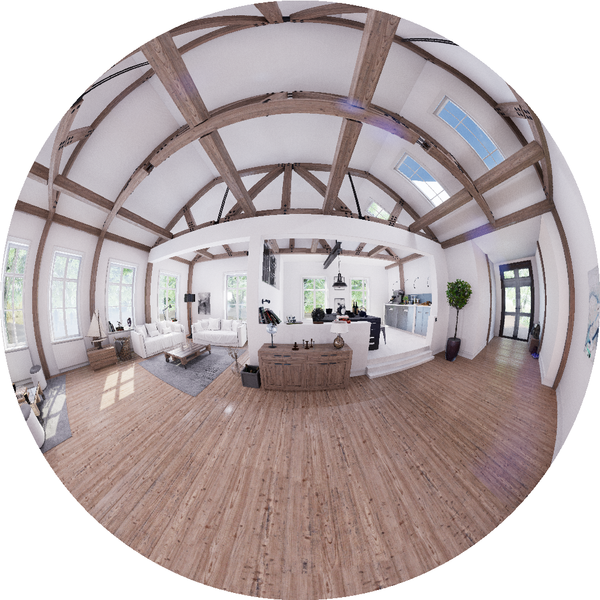
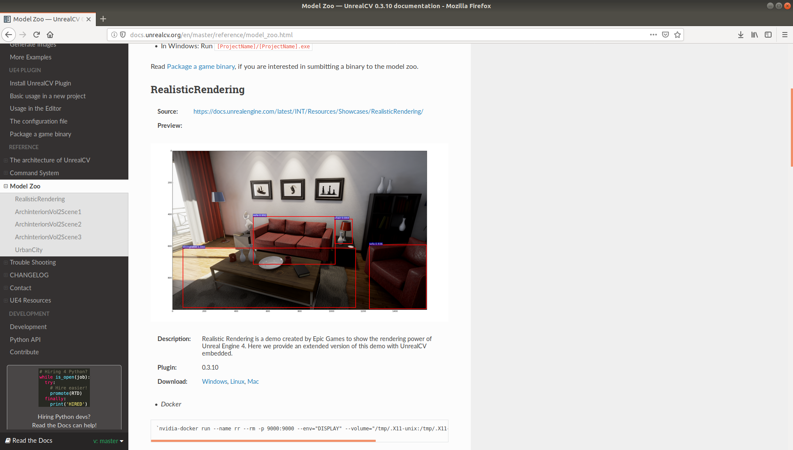
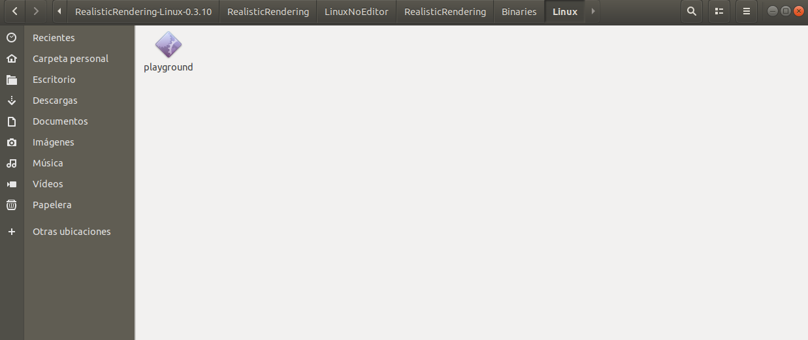
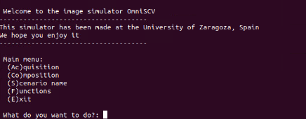

# OmniSCV: Omnidirectional Synthetic image simulator for Computer Vision
Python 2.7 implementation for a camera simulator.

## Introduction
This repository contains the python scripts to obtain synthetic realistic images from a list of camera models. 
<p align="center">

  </p>
  
### Camera models
In this simulator we include two types of cameras, central and no-central cameras.
For the central cameras, we have implemented:</p>
 - Equirectangular
 - Cylindric
 - Catadioptric cameras:
 	- Para-Catadioptric
	- Hyper-Catadioptric
	- Planar-Catadioptric
 - Fish eye cameras:
	- Equiangular
	- Stereographic
	- Equi-solid angle
	- Orthogonal
 - Scaramuzza 
 - Kannala-Brandt
 
For no-central cameras, we have implemented:</p>
   - Panoramic
   - Catadioptric cameras:
      - Spheric mirror
      - Conic mirror
	
## Citing

## Use Instructions

### Install Requirements

#### This code has been compiled and tested in Linux using:
  - python 2.7
 
#### Install  python requirements:
  To use this image simulator, first you have to make sure that you have installed the following python packages:</p>
  - UnrealCV 
  - Numpy 
  - Math 
  - Pillow 
  - StringIO 
  - os 
  - scipy.optimization
  - OpenCV (cv2)
  - Open3D

### User guide

#### First steps
 After download this repository on your own PC, you have to copy the simulator folder called "Pack" in the same directory where the UnrealCV executable is located. In the example we will see how this path looks like.</p>
 With our "Pack" placed in the correct directory, we enter the folder and we will find several files. The main script is "simulator.py". From this script we will run the image simulator OmniSCV and we will be able to obtain the images from the virtual environment. The other files we can find in the folder are:
 - cam_loc.txt : in this file we will specify the locations from where we want to take the images
 - cam_rot.txt : in this file we will set the rotation for each location. This file is prone to use for trajectories.
 - mask_list_scene.txt : we will save the name of the objects in the scene in this file as well as the semantic segmentation color
 - layout_list_scene.txt : we will save the name of the objects that build the layout of the room in this file
 - cube_rot.txt, layout_colors_scene.txt : this files will not be used by the user, are for support the main program

#### OmniSCV

 This cameras are modeled acording different mathematical models. These models are explained with detail in the papers of [Jesus Bermudez](http://webdiis.unizar.es/~bermudez/) and the article of [Bruno Berenguel](sensors)</p>
 Once known the models, we start to build the images of this simulator mapping our environment in a sphere arround the camera. As an sphere is difficult to obtain from planar images, we aproximate it with a cube-map formed by 6 images in the main directions (the cartesian axis X, Y, Z). We build a cube-map for each location in our scenario where we want to make an image. To do so with our simulator, we first need to set the locations where we want to take the images. Editing the file 'cam\_loc.txt', we set the different locations where we are going to get the cube-maps. In this file we have to write the coordinates (x,y,z) in one line and separated by white spaces for each location. 
 <p align="center">

  </p>

 Defined each location in the environment from where we take the acquisition, we run our main program 'simulator.py'. After we run the program, a menu will appear (If it takes more than 5 seconds to appear we recomend to close and reopen the simulator). From this menu we will be able to chose differenct functions. <\p>
 The first one to appear is Acquisition. This function makes an image acquisition from the virtual environment for the composition of central projection images. <\p>
 The second option is Composition. Here we can choose which kind of image we want to compose. It's divided between central and non-central projection systems. For the central projection systems we need to build the cube-maps (made with the acquisition). For the non-central systems, since acquisition and composition are mixed, you can do the composition directly, without previous acquisition. <\p>
 Next comes Scenario. It will give the name of the scenario to the composed images. Usefull for large data-sets with different scenarios. <\p>
 And last but not least, Functions. It under development, stil have some bugs. However, we can obtain ground truth information of the layout of the scene extracting the layout of the environment (removes the objects of the scene and makes a cube-map). Besides, we can create trajectories, compound videos from frames and make reconstructions of the scene via point cloud from the omnidirectional images builded.

```bash
	$ python simulator.py

	 Welcome to the image simulator OmniSCV
	-------------------------------------
	This simulator has been made at the University of Zaragoza, Spain
	We hope you enjoy it
	-------------------------------------

	 Main menu:
	  (Ac)quisition
	  (Co)mposition
	  (S)cenario name
	  (F)unctions
	  (E)xit

	 What do you want to do?: 
```

## Step-by-step example
First thing we are going to do is download a scenario from [UnrealCV](http://docs.unrealcv.org/en/master/reference/model_zoo.html) In this example, it will be RealisticRendering.
<p align="center">

  </p>

Once we have downloaded the scenario and unzipped it, we go to the directory of the executable and copy the folder of our simulator.
<p align="center">

  </p>

Watch video tutorial [<p align="center">
](https://youtube.com)

## Contact

### Get OmniSCV
To obtain the code, send a message to Bruno Berenguel (berenguel@unizar.es).<\p>
Please, in the message present yourself and your organization and explain why you want the simulator.

### Download Data set
Not Available yet: [download](https://github.com/Sbrunoberenguel/ImageSimulator)

### Download Models
UnrealCV scenarios: [download](http://docs.unrealcv.org/en/master/reference/model_zoo.html)


## License 
This software is under GNU General Public License Version 3 (GPLv3), please see [GNU License](http://www.gnu.org/licenses/gpl.html)

For commercial purposes, please contact the authors.


## Disclaimer

This site and the code provided here are under active development. Even though we try to only release working high quality code, this version might still contain some issues. Please use it with caution.

